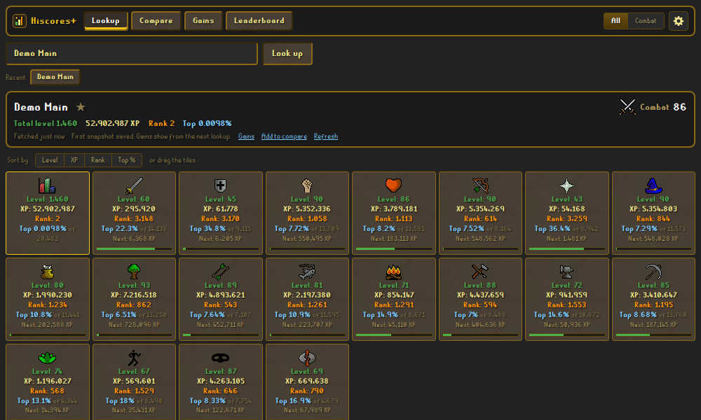

# Skills+

Hiscores and a goal planner for [Lost City](https://2004.lostcity.rs) (2004scape), made to run as a
[LostKit](https://github.com/LostHQ/LostKit-Electron) tool. Formerly Hiscores+.

**Open it:** <https://im-hari-potter.github.io/hiscores-plus/>

## Add it to LostKit

In LostKit, click **Add tool** and enter `im-hari-potter.github.io/hiscores-plus`. The name and icon
are filled in automatically. If you added it back when it was called Hiscores+, rename the tool in
LostKit, or remove it and add it again. Your saved data stays either way.

## What it does

### Hiscores

- **Lookup** shows every skill's level, XP, rank, XP to the next level, and **Top %**. Top % is your rank
  divided by the number of players ranked in that skill.
  - Sort the tiles by level, XP, rank or Top %, or drag them into your own layout.
  - The names you've looked up are kept under **Recent**. Take one off with its ✕, or **Clear** the
    list. A name comes back when you look that player up again.
  - Tiles show your goals once you set some: the goal in yellow, and the tile's bar becomes your
    progress toward it (since you set it) in place of the bar to the next level.
- **Combat** shows only the combat skills and your combat level, worked out with the game's own formula.
- **Compare** puts up to 5 players side by side and highlights the leader of each skill.
- **Gains** shows XP, levels and ranks gained since last time, a day, a week or a month ago.
  - **Show snapshots** lists the ones stored for that player. Delete any one of them (click twice), or
    the whole history.
- **Leaderboard** shows any skill's hiscores, 21 at a time, with Top % next to every rank.

### Planner

The planner works out what it takes to reach a goal, from your XP on the hiscores, what's in your bank
and the prices you set. Every skill has its planner: set a goal in any of them and open its plan.

- **Goals**: set a **level, XP, rank or top %** goal in any skill. Your XP comes from the hiscores.
  - Move goals up and down to put them in your own order. Show only the ones in progress or reached,
    or only one skill.
  - A rank or top % goal becomes "beat whoever holds that rank now", and it re-checks as they train.
  - **Edit** (beside a goal's title) moves the goalpost: type a new target, or switch the goal to
    another kind (level, XP, rank, top %). Its plan, ticks, order and progress bar stay as they are.
  - **Combat level**, under the skill picker: your combat level now, and what it is once your goals
    in the combat skills are reached. **Combat calculator** opens the card Lookup has under Combat:
    how the level is made up, what gets the next one, and a box for each combat skill. The boxes
    start from your levels with your goals reached; type a level to try it, and reset to go back.

#### How the calculators work

- Every number comes from the game itself (Lost City's server content): the level each way to train
  needs, the XP it gives, and what it takes and makes. The maths is done in tenths of XP, like the
  game does. From Crafting on, the rows are those of LostHQ's calculators
  ([Crafting](https://2004.losthq.rs/?p=calculators&calc=crafting),
  [Mining](https://2004.losthq.rs/?p=calculators&calc=mining),
  [Smithing](https://2004.losthq.rs/?p=calculators&calc=smithing),
  [Fishing](https://2004.losthq.rs/?p=calculators&calc=fishing),
  [Cooking](https://2004.losthq.rs/?p=calculators&calc=cooking),
  [Thieving](https://2004.losthq.rs/?p=calculators&calc=thieving),
  [Agility](https://2004.losthq.rs/?p=calculators&calc=agility),
  [Prayer](https://2004.losthq.rs/?p=calculators&calc=prayer),
  [Magic](https://2004.losthq.rs/?p=calculators&calc=magic)), each one checked against the
  server; where the two differ, the server's number is used. The combat skills do the sum of its
  [Combat XP](https://2004.losthq.rs/?p=calculators&calc=combat_xp) calculator, on the server's
  own monsters.
- How many you need = the XP still to go ÷ the XP each one gives, rounded up.
- **Gross** is what something is worth, with nothing taken off. **Net** takes off what you pay for its
  supplies, so it can be negative: a loss.
- A plan has three parts:
  1. **From your bank**: what the items in your bank make, best XP first (the one you train with goes
     first when it can), including steps on the way like unfinished potions. Each step shows what it
     makes is worth, and the total is its **Gross**. Drag its lines to change what your bank is used
     for first (see Your own order below).
  2. **Then, to reach your goal**: the rest, made the way you pick under **Train with**. If you're
     short of levels for it, the plan works up to it with the best one at each level on the way
     (willows to 45, maples to 60, then yews). Below that: what to collect or buy, what to bring, what
     buying it all costs, what it makes is worth, and the net.
  3. **Every option**: one row for each way to train, side by side (see the table below). Click a row
     to train with it.
- Per skill:
  - Herblore: where two potions want the same herb or secondary, the more useful one gets it first.
    Super attack uses your irits before Superantipoison does, and Prayer potion your snape grass
    before Fishing potion. The one you train with still goes first, and so does anything you drag
    above it.
  - Runecraft counts in essence, and shows how many runes each essence makes at your level (×2, ×3…).
  - Woodcutting needs nothing but an axe, so its plan is the logs to chop and what they're worth.
  - Firemaking burns the logs in your bank, best first.
  - Fletching has every way to train: bows cut and strung (or only cut, or only strung), arrows from
    logs or step by step, darts, and bolts. The table shows one of those at a time.
  - Crafting has every row of LostHQ's calculator, in its four tabs: **Needle & thread**,
    **Jewellery**, **Pottery & glass** and **Spinning**. The table shows one tab at a time.
    - What one row makes can go into another. With uncut sapphires, gold bars and wool in your bank,
      the plan cuts the sapphires and spins the wool on the way to the amulets, and counts that XP
      too. It does the same with sand and soda ash for glass, and with leather for studded armour.
      Unticking a row (cutting sapphires, say) only stops it being made for its own sake: a ring
      you've left ticked still has its sapphire cut on the way.
    - What's still to buy is listed the way the calculator lists it: cut gems for jewellery, molten
      glass for vials and orbs, a leather body for a studded one.
    - Hides are tanned before they're worked, and **the tanner's fee is counted**: it's in the
      supplies (as coins) and in every cost and net. Pick the tanner on the goal:
      - **Al Kharid** (the default): leather 1 gp, hard leather 3 gp, dragonhide 20 gp a hide.
      - **Canifis**: 2 gp, 5 gp and 45 gp.
      - Dragonhide: the plan uses the dragon leather in your bank first and tans your hides on the
        way. What to collect is the hide, as on the calculator.
      - Cowhide in your bank is tanned into leather or hard leather on the way. What to collect is
        leather, as on the calculator.
      - Under From your bank the fee is its own line (**Tanner**), taken off for the Net. In the table
        it comes off in Total net, so Gross from banked supplies stays a gross.
    - **Key halves and crystal keys** count as the uncut dragonstone the crystal chest always gives:
      a tooth and a loop join into a key, and a key opens the chest. With 9 teeth and 4 loops your
      bank makes 4 for now, and Round up my supplies says 5 more loops make it 9. The chest's other
      loot is luck, and isn't counted. From scratch a row still takes the uncut stone.
    - A whole job is one row: an amulet made and strung, a pot shaped and fired. Hover over the row
      for the XP of each step.
    - A reel of thread lasts five items (see Vials of water and thread below).
    - Two kinds of row are added for what they sell as. Their Crafting XP is the calculator's.
      - **Dragonhide sets**: vambraces, chaps and body, which the market trades together as one
        item. A green set is 372 XP and six hides. A set isn't an item in the game, so it has a price
        (on the Prices tab) but no place in your bank.
      - **Enchanted jewellery**: a ring of recoil, a games necklace(8), a ring of dueling(8), an
        amulet of glory(4) and the rest, each right under the piece it's made from. The runes of
        the enchant spell are in its supplies and its cost: a cosmic rune and the elemental ones
        (counted even where a staff would save them). Enchanting gives Magic XP, not Crafting XP,
        so the row's XP is the plain piece's; hover over the row for the Magic level it takes and
        the Magic XP of one cast. An amulet of glory is then charged at the Fountain of Heroes,
        which costs nothing. An **uncharged** amulet of glory is an item of its own in your bank
        and on the Prices tab; the row makes the charged one.
      - The bank plan makes the plain piece (the XP is the same) unless you pick the enchanted one
        under **Train with** and have the runes in your bank, or you've unticked the plain one.
    - **Battlestaves**: the orb on a battlestaff is an unpowered orb charged with a Charge Orb spell
      (30 of the element's runes and 3 cosmic runes; Magic 56 for water, 60 earth, 63 fire, 66 air).
      The plan does that on the way:
      - Charged orbs in your bank are used first, then unpowered orbs, then molten glass (blown into
        orbs on the way, which counts its 52.5 XP), as far as your runes go.
      - What's still to buy lists the unpowered orbs and the runes instead of the orb, and the
        orbs or glass you already have come off it: 2,000 molten glass are 2,000 fewer orbs to buy.
    - **Magic XP**: a line under each part of the plan adds up what the spells cast on the way give
      (enchanting, charging orbs), spell by spell, with the Magic level each takes. It isn't part
      of the Crafting XP above it. A spell above your Magic level is marked in red with your level
      next to it (that part of the plan waits for it); otherwise, hover over the line for the
      Magic level that XP takes you to.
    - Where the calculator and Lost City's server differ, the server is followed: a sapphire
      necklace is level 20 (the calculator says 22). Opal, jade and red topaz can smash when you cut
      them; like the calculator, plans count every cut as a success.
  - Mining needs nothing but a pickaxe you have the level for, so its plan is the ores to mine and
    what they're worth, like Woodcutting. It has every rock of LostHQ's Mining calculator.
    - A **gem rock** gives one gem by chance, so what it makes is the server's chances: out of 128,
      opal 60, jade 30, red topaz 15, sapphire 9, emerald 5, ruby 5, diamond 4.
    - **Limestone** (level 10, 26.5 XP) is added: the server has it, the calculator doesn't.
    - **Bars** (beside **Rocks**, above the table) plans by the bar: a row is the ore one bar takes,
      mined in the furnace's own proportions. A steel bar is 1 iron ore and 2 coal, 135 XP; a runite
      bar 1 runite ore and 8 coal, 525 XP. A plan's line reads "Ore for 10,635 steel bars: 10,635 Iron
      ore + 21,270 Coal". The level is the Mining level the ore takes; the row's tooltip has the
      Smithing level to smelt it.
      - Iron has two rows: 2 ore a bar (half the ore is lost in a furnace), or 1 with a ring of forging
        or Superheat Item.
      - Rocks are what a plan picks by itself. Click a bar's row, or pick it under Train with, to plan
        by the bar; bars work in a mix too.
  - Smithing has every row of LostHQ's Smithing calculator: its smelting list, and what each metal
    makes on the anvil. The table shows one at a time: **Smelting**, **Bronze**, **Iron**,
    **Steel**, **Mithril**, **Adamant**, **Rune**, in that order however the table is sorted.
    - Ore in your bank is smelted on the way to what you smith, and that XP counts: at level 99,
      100 runite ore, 800 coal and 7 bars make 21 platebodies and a scimitar.
    - Three choices sit on the goal. They stand in for the calculator's two extra rows and its
      modes:
      - **Bars**: where yours come from.
        - **Buy them** (how it starts): what's still to buy is bars. A million XP is 2,667 rune
          platebodies and 13,335 runite bars. That's the calculator's Smithing mode.
        - **Smelt them**: what's still to buy is ore and coal, and the smelting XP counts, so it
          takes fewer: 1,600 platebodies, 8,000 runite ore and 64,000 coal. That's its Smelting +
          smithing mode. The XP column and Train with show the XP with the bars in it: 625.
        - **Superheat them**: the same, made with Superheat Item (Magic 43). A bar takes a nature
          rune and 4 fire runes on top and gives 53 Magic XP, and iron never fails. The Magic XP
          shows in its own line, as for enchanting.
      - **Ring of forging**: off, half the iron ore is lost in a furnace, so an iron bar takes 2
        ore on average. On, every ore is a bar and the rings are counted: one lasts 140 bars. It's
        left out when you superheat, which needs no ring.
      - **Goldsmith gauntlets**: on, a gold bar gives 56.2 XP. Off, 22.5.
    - What comes several to a bar is counted in bars: 100 bars → 1,500 arrowtips, 1,000 dart tips,
      500 knives, 400 cannonballs or 200 nails.
    - Cannonballs come out of a furnace with an ammo mould; everything else takes a hammer. Dart
      tips wait for The Tourist Trap and claws for Death Plateau: hover over the row.
    - The Elemental Workshop's bar is there, as on the calculator. It can't be superheated.
  - Fishing has every fish of LostHQ's Fishing calculator. It never uses your bank, like Woodcutting
    and Mining: a plan is the fish to catch and what they're worth.
    - **Also bring** names the gear for the spot: a net, a rod, a harpoon, a lobster pot.
    - A catch with a rod takes a **bait or a feather**, listed to buy. (What's in your bank isn't
      counted for those.)
    - A **big net** brings up mackerel, cod and bass together, and now and then boots, gloves,
      seaweed, an oyster or a casket. Each of the three fish has its row, counted on its own.
    - A plan doesn't pick a big net's fish by itself, nor karambwanji, karambwan, slimey eels or lava
      eels, which take a quest or an out-of-the-way spot. Click one to train with it.
  - Cooking has every row of LostHQ's Cooking calculator, in its tabs: **Fish**, **Meat**,
    **Pies & pizza**, **Gnome** and **Other**. The table shows one tab at a time.
    - Raw fish and meat in your bank are cooked. A pie, a pizza, a cake, a stew or a wine is put
      together first, and anything on the way counts: flour and water, dough, a pie shell.
    - **Burnt food is counted**, by the server's own chances, a level at a time. At level 51 on a
      range, 188 lobsters in 256 cook. So 400 raw lobsters come to about 298 lobsters (two levels are
      gained on the way, and each burns less), and 1,050 more take about 1,312 raw ones.
      - A row says how much burns at your level now ("27% burn"); hover over it for the level it stops
        at. Lobsters stop burning at 74, sharks never do without gauntlets.
      - Everything in your bank goes on the range: 400 raw lobsters are 400 cooked, about 102 of them
        burnt.
      - Food that can't burn any more is cooked first where that gains a level before the rest goes
        on. Drag the lines to cook in another order.
    - Three choices sit on the goal:
      - **Cook on**: a range (how it starts), Lumbridge Castle's range (it burns less of 19 low-level
        foods, once Cook's Assistant is done), or a fire (cod, swordfish, shark, sea turtle and manta
        ray burn more on one). Pies, pizzas, cakes and bread need a range whatever you pick.
      - **Cooking gauntlets**: on, lobster, swordfish and shark burn less. Lobsters stop burning at 64
        and sharks at 94.
      - **Burnt food**: **Count it** (how it starts), or **Leave it out**: every cook works, the way
        LostHQ's calculator counts.
    - A topped pizza is a plain pizza baked, then the topping; a chocolate cake is a cake baked, then
      the chocolate. The row's XP has the bake in it, as on the calculator (a meat pizza: 143 + 26).
    - Where the calculator and the server differ, the server is followed: a jug of wine is 110 XP
      (the calculator says 200), a cooked chompy 14 (100), a pineapple pizza 188 (195) and a manta ray
      216.3 (216.2). Wrapping an oomlie in a palm leaf (10 XP) is added: the server has it, the
      calculator doesn't.
    - Left out, as on the calculator: finishing gnome dishes and cocktails, ugthanki kebabs, gnome
      restaurant deliveries, and pasting jogre bones.
    - Dough takes a bucket of water here; in the game a jug of water does too.
    - Quest food (karambwan, slimey eel, lava eel) and the two fish only the trawler gives (sea
      turtle, manta ray) aren't what a plan picks by itself: click one to train with it.
  - Thieving has every row of LostHQ's Thieving calculator, in its tabs: **NPCs**, **Stalls**,
    **Chests** and **Doors**. It never uses your bank, like Mining and Fishing.
    - A plan counts **thefts that work**: one that fails gives no XP. Hover over a row for how often
      it works at your level, by the server's own roll (a guard: 59 in 100 at level 54).
    - With nothing picked, a plan picks pockets, the best one at your level. A chest is more XP, and
      empty for minutes after.
    - **Net/item** is what one theft brings in on average: its coins, and its loot at the price it
      sells for, handed out the way the server does it. A rogue's 25 to 40 coins come every time and
      a lockpick on top 5 times in 127; a stall gives one thing, by its weight.
    - Three doors and the steel arrowtips chest want a **lockpick** (Also bring).
    - Where the calculator and the server differ, the server is followed: a Digsite workman takes
      level 25 (the calculator says 10), the 10 coin chest level 13 (1), and the Magic axe hut door
      gives 25 XP (22.5). Added, since the server has them: Fremennik citizens (level 45, 65 XP), the
      rock cake stall in Gu'Tanoth, and two house doors in East Ardougne.
    - Fremennik citizens and Rellekka's stalls wait for The Fremennik Trials, so a plan doesn't pick
      them by itself.
  - Agility has the courses and shortcuts of LostHQ's Agility calculator. Nothing goes in and nothing
    comes out, so its plans have no bank and no money columns, and the Prices tab leaves it out.
    - A course is counted in **laps**: its obstacles in order, and the bonus for the lap.
      - A Barbarian Outpost lap is 139.5 XP: it climbs three crumbling walls. (The calculator counts
        one: 114.5.)
      - A Wilderness lap is 571.4 XP. The ridge at its gate is once a visit, not a lap. (The
        calculator's 586.4 has it in.)
    - Shortcuts are as the server has them: the Falador wall gives 12.5 XP (the calculator says 0.5),
      and the Karamja stepping stones ask for no level (30). Added: the Yanille Agility dungeon's
      ledge, pipe and rubble, and the climbing rocks on the Watchtower.
    - **The Agility Arena** is three rows, in place of the calculator's 14 obstacles and five
      exchanges. A pillar gives a ticket, and the ticket is exchanged for XP; the rows are named for
      the XP they count:
      - **XP per pillar: 57.8 XP**, what getting to a pillar gives on the way. For when your tickets go
        on herbs or another reward instead of XP. The arena is 25 platforms with an obstacle between
        every two next to each other, and a ticket pillar on all but one. The server lights a pillar
        at random, and a ticket takes the way from one pillar to the next. Read off the server's map,
        the shortest way is 3.3 obstacles on average over every pair of pillars, worth 57.8 XP. (Below
        level 40 some obstacles are shut and the way round is longer, so it's a little more.)
      - **XP per ticket: 240 to 320 XP**, what a ticket is exchanged for, by the batch: 240 for one
        ticket, 248 each for 10, 260 for 25, 280 for 100, 320 for 1,000. It's also the row for
        tickets you've saved: type how many under Plan to make. They're exchanged with the ones still
        to earn (950 saved: 50 more fill the 1,000).
      - **Total XP**: the two together, a ticket earned and exchanged.
      - **Together**: a plan exchanges its tickets together, in the biggest batches they fill, and
        counts each at the average. 1,666 tickets are 1 × 1,000, 6 × 100, 2 × 25, 1 × 10 and 6 single
        ones: 303.1 XP each, 360.9 with the way there. A batch has to be whole, so a goal just past
        what 999 tickets give takes 1,000, and the plan says how much that is over.
      - **Tickets exchanged**, on the goal, pins a batch instead: every ticket at 320 XP, say, when
        you're saving up for 1,000 at a time, whatever the plan's size.
      - The count is exact: the fewest tickets that reach the goal once they're exchanged. The average
        is to a tenth of an XP. Saved tickets finished with something else, laps say, are rounded
        down, so the laps never come out short.
      - It counts a ticket for every pillar, one a minute at best. Miss a pillar and the next one
        gives no ticket, so it takes more obstacles than this.
    - Left out: obstacles that belong to a quest's own area (Trollheim, the lighthouse, Shilo Village,
      the Underground Pass), and gnomeball.
  - Prayer has the bones of LostHQ's Prayer calculator, buried from your bank like Firemaking's
    logs: the best bones first, then the rest of the goal in the bones your bank mostly had (dragon
    bones, with none in it).
    - Added, since the server drops them: monkey bones (5 XP) and Shaikahan bones (25 XP).
    - Left out: the jogre bones Tai Bwo Wannai Trio has you burn, paste and marinate (16 to 18 XP,
      and not to be traded), shades' remains burnt on a pyre in Mort'ton, and ghasts.
  - Magic has the spells of LostHQ's Magic calculator, grouped by how you train with them:
    **Combat**, **Curses**, **Utility**, **Enchantment** and **Teleports**. Every row has its own
    XP, runes, bank use, prices and Net. Nothing is shared with the Crafting and Smithing rows that
    cast the same spells on the way: those are as they were.
    - **Your bank.** Magic stays a goal of its own, and counts every rune your bank holds:
      - **What a spell is cast on** comes first: rings to enchant, ore to superheat and orbs to
        charge are planned from your bank by themselves, and get the runes they share with other
        spells before those do.
      - **Made on the way.** A bank holds gold bars and gems, or molten glass, more often than the
        rings and orbs themselves. So gems are cut, jewellery made (and strung), glass blown into
        orbs and key halves turned into dragonstones on the way, where your Crafting level allows,
        and your cosmic runes are counted for them: 300 gold bars, 250 sapphires and 250 cosmic and
        water runes are 250 rings of recoil. That Crafting XP isn't part of the Magic goal; a line
        under the plan says what it comes to. What the rest of the goal has you buy is still the
        ring or the orb itself.
      - **Law runes** go to teleports, and **mind, chaos, death and blood runes** to combat spells:
        the best your Magic level and the runes beside them allow, and the next best once a rune
        runs out (Fire Bolt while the fire runes last, then Wind Bolt). A level gained on the way
        opens the next spell. As everywhere, it's the order that gets the most XP out of your bank.
      - **Asked for**: a curse, alchemy and the odd ones wait until you train with one (click it in
        the table) or put it in your order, since runes alone don't say you mean them. So do the
        teleports that wait for a quest, and the spells cast with a staff of their own.
      - Either way your bank's runes come off what the rest of the goal has you collect.
    - With nothing picked, a plan finishes with the best combat spell at your level, or carries on
      with the combat spell your bank's runes mostly went to.
    - **Staff**, on the goal: None, Air, Water, Earth, Fire or Lava. A staff stands in for its
      rune, so those runes are left out of what a spell takes and costs, and the plan says to
      bring it. Any staff of the element does (a staff of air, an air battlestaff, a mystic air
      staff); a lava staff is earth and fire in one.
    - **Combat**: a spell gives its XP for the cast, hit or miss, and 2 XP more for every point
      of damage. **Damage**, on the goal, says what to count:
      - **Leave it out** (how it starts): only the cast, as on LostHQ's calculator. It's the
        most casts a goal can take.
      - **Every cast hits**: each cast also counts half its max hit, the average of a hit (a Fire
        Strike: 11.5 + 8). **Half the casts hit**: half of that.
      - How often you really hit depends on your target and what you wear, and a hit can't do
        more damage than your target has left.
    - **Curses** give their XP whether they take hold or not, but can't be cast on a target
      that's already weakened or held.
    - **Utility**:
      - **Low and High Level Alchemy** count the runes only. Any item will do, so what you alch
        and the coins it turns into aren't counted here.
      - **Superheat Item** is a row for each bar: the ore goes in and the bar comes out, so its
        Net is the bar less the ore and the runes. It never fails on iron. With coal in your bank,
        iron ore goes to steel bars first. A row says the Smithing level its bar takes; the
        Smithing XP isn't counted here.
      - Bones to Bananas, Telekinetic Grab and Charge count their runes.
    - **Enchantment**: Lvl-1 to Lvl-5 Enchant are a row for each piece of jewellery (a sapphire
      ring in, a ring of recoil out), and the four Charge Orb spells take an unpowered orb. An
      amulet of glory comes out uncharged; its row makes the charged one it's traded as, since
      the Fountain of Heroes charges it for nothing.
    - **Round up my supplies**: runes never hold back what you enchant, superheat or charge. With
      300 sapphire rings and 100 cosmic runes all 300 are enchanted, and the 200 cosmic runes
      you're short of go on the list to collect. Spare runes never call for more rings, nor for
      more runes: a spell your bank casts by itself goes as far as its runes and no further. The
      spell you train with is rounded up to the rune you have most of. Gold bars with too few
      gems round up to the bars, with the gems to collect.
    - Where the calculator and the server differ, the server is followed: Crumble Undead gives
      49 XP (the calculator says 24.5), Enfeeble 83 (89), Entangle 89 (90), Stun 90 (80), Falador
      Teleport 48 (47) and Charge Water Orb 66 (56). Trollheim Teleport (level 61, 68 XP) is
      added: the server has it, the calculator doesn't.
    - Not what a plan picks by itself (click one to train with it): Crumble Undead (the undead
      only), Iban Blast and the god spells (a staff of their own), the teleports that wait for a
      quest, the superheat and orb rows, Bones to Bananas, Telekinetic Grab and Charge.
  - **Attack, Strength, Defence, Hitpoints and Ranged** are trained on monsters: a row is a
    monster, and a plan counts kills. They never use your bank or any prices: food, gear,
    ammunition and drops aren't counted.
    - **A kill is the monster's hitpoints in damage**, however many hits it takes (a hit can't do
      more damage than the monster has left). Every point of damage gives XP by your style, the
      server's own sum:
      - 4 XP to the skill the style trains: Accurate (Attack), Aggressive (Strength), Defensive
        (Defence), Accurate or Rapid (Ranged).
      - **Controlled**: 1.33 XP each to Attack, Strength and Defence. **Longrange**: 2 XP each to
        Ranged and Defence.
      - And 1.33 Hitpoints XP whatever the style. A Hitpoints goal counts that.
      - **Style**, on the goal, picks which. A moss giant (60 hitpoints) is 240 Attack XP on
        Accurate, 79.8 on Controlled.
      - LostHQ's calculator counts Hitpoints, and each skill of Controlled, as a third of the 4
        (1.333); the server gives 1.33, and rounds each hit's XP down to a tenth, so many small
        hits come to a little less than a row says.
    - **The monsters** are the server's: every NPC with an Attack option and hitpoints that's in
      the world, 315 of them. A row is a name, a combat level and hitpoints; where two share a name
      and a level, the hitpoints say which.
      - **Search** by part of a name, or by a combat level (`giant`, `skeleton 22`). It looks
        through every monster, whatever band of levels is shown.
      - Or browse: the bands of combat level above the table (Level 1–10 … Level 111 and up, All),
        and the same list under **Train with**. Click a row to train on it.
      - Hover over a row for what else a kill gives, what the monster leaves to bury, how many of
        it the world has, and any catch (marked \*): a citizen of Canifis turns into a werewolf
        unless you wield a Wolfbane dagger, a ghast has to be made visible first, a quest's foe can
        only be attacked at some point of its quest, a shade is a shadow until it's attacked.
      - Left out: random events, Tutorial Island, and what only a quest's script brings in for one
        fight. The Mage Arena's battle mages are a row of Hitpoints alone: only Magic works there.
      - Where LostHQ's data and the server differ, the server is followed: two skeletons whose
        level and hitpoints are the other way round.
    - **With no monster picked**, a plan trains on the one that gives the most XP a kill among
      those no more than half your combat level: rock crabs for most of the way, then white
      knights, moss giants and ice giants. Never one there are fewer than five of (a quest's foe,
      a boss), or one with a catch.
    - **Also from these kills**, under each part of the plan: the Hitpoints XP on the way (and
      the other skills', on Controlled or Longrange), with the level it takes you to, and the
      Prayer XP of the bones they leave if you bury them.
    - The Black Knight Titan gives 1 XP a point of damage whatever the style, and Chronozon 2.5%
      of the usual: the server's own rules, and their rows say so.
- Click an item a plan says to collect, buy or bring to open its page on the market.

#### Check your prices first

Costs, gross, net and gp per XP are only as good as the prices behind them. Market prices come from what
players have listed and sold lately, and some items have few listings or none. **Look over the Prices
tab for the items you'll use, and pick or type the price that's right for you** (see Prices below).
Anything without a price shows **?** until it has one.

#### Use my bank

- **On** (the default): your bank is put to work first.
  - **From your bank** lists what it makes and what each part is worth. The total is **Gross**:
    your banked supplies are already yours, so nothing is taken off for them.
  - Everything after it comes after all your bank makes: its XP counts toward the goal, and what's left
    in your bank is used before anything is collected.
- **Off**: the plan starts from scratch, as if your bank were empty. Plan a mix of your own instead
  (below), or let one way to train take you all the way.

#### Your own order

The lines under **From your bank** can be dragged up and down, by the grip at their left. Your bank
then goes to the top line first, and down the list from there: drag Fishing potion above Prayer
potion and it gets the snape grass first.

- The order is kept with the goal. **Back to the usual order** undoes it.
- **N more your bank could make instead** lists what the lines above leave nothing for
  (superantipoison, when super attacks took the irits). Click one to put it first.
- Anything you haven't placed follows the usual rules, after the ones you have.
- **Round up my supplies** keeps to your order too.

#### Plan a mix (Use my bank off)

With your bank left out, you can plan your own path to the goal: type how many of each you'll make in
the table's **Plan to make** column (1,000 prayer potions, then 2,000 super attacks, say). For a
combat skill it's **Plan to kill**: 500 fire giants, then the rest on moss giants.

- **Your mix** shows what that comes to: the XP and the level it gets you to, what buying it all costs,
  what it makes is worth, and the net. It's made lowest level first, and anything that needs a level
  you won't have by then is marked.
- Its XP counts toward your goal. The rest is planned after it (**Then, to reach your goal**), with a
  total for both together, and the table shows **Still needed to goal** after your mix.
- The mix is kept with the goal. With **Use my bank** on, your actual bank is used instead, and the mix
  waits until you turn it off again. Skills that never use the bank (Woodcutting) can always have one.
- In Crafting, what one row of your mix makes for another is used: cut 100 sapphires and make 100
  sapphire rings, and the list to buy has the uncut sapphires and the gold bars, not cut sapphires as
  well.

#### The table of every option

| Column | Use my bank on | Use my bank off |
|---|---|---|
| **Use** (first) | Lets the bank plan make it (see below) | the same |
| **XP** | XP for one | the same |
| **Net/item** | What one sells for, less what it takes, bought from scratch | the same |
| **gp/XP** | What each XP costs you (negative: you make money doing it) | the same |
| **To goal** | not shown | How many to reach the goal, on their own |
| **Plan to make** | not shown | How many you'll make in your mix (see above) |
| **From bank** | How many your bank makes of it now | not shown |
| **Gross from banked supplies** | What your bank plan makes of it (its part of From your bank) is worth, before any rounding up. Your banked supplies are yours already | not shown |
| **Round up my supplies** | What to collect so nothing in your bank is left over: your most plentiful ingredient decides | not shown |
| **Net after rounding up my supplies** | What your bank makes of it once your supplies are rounded up is worth, less what rounding up takes to collect. Your banked supplies are yours already. Shown with Round up my supplies | not shown |
| **Still needed to goal** | How many more to reach your goal, after everything your bank makes | After your mix, once you've planned one |
| **Supplies needed** | What those take, beyond what's left in your bank | not shown |
| **Net after buying supplies** | What the ones still needed are worth, less what their supplies cost | not shown |
| **Total net gp toward goal** | Gross from banked supplies + net after buying supplies: the gp it all comes to on the way to your goal, from your bank and from what you still buy. Net after rounding up my supplies isn't part of it, since rounding up would count those supplies twice | not shown |

Sort the table by level, XP each, cheapest XP, or (with your bank in use) **Total net**, most gp toward
your goal first. Agility and the combat skills have nothing to price, so their tables have no Net/item
and gp/XP. A combat skill's table shows each monster's combat level (**Lvl**) and hitpoints (**HP**).

For example, Herblore 74 → 78 with Super attack: with the bank off, **4,328** to the goal. With it on,
**2,305** still needed after everything the bank makes, and the supplies those need. And with
605 kwuarm and 518 limpwurt root in the bank, Super strength's **Round up my supplies** says collect 87
limpwurt root, and your bank covers 605 instead of 518.

Each group's name (Potions, Bows, Jewellery) sits right above the names in it.

#### Round up my supplies

**Round up my supplies** (the tick box right after Use my bank) switches the plan between two views of
your bank. It's one or the other: the table below already shows both side by side.

- **Off**: your bank as it is. 605 kwuarm and 518 limpwurt root make 518 Super strength.
- **On**: your supplies rounded up, so nothing in your bank is left over. The same bank makes 605, and
  the 87 limpwurt root it takes are listed to collect.
  - **From your bank, supplies rounded up** shows the XP and level your bank holds then. Each line is
    what your bank makes of it in all, with what to collect for it.
  - What's rounded up: first what your bank already makes, then anything else that's one ingredient
    short: irit with no eye of newt, bows cut but not strung, dart tips without feathers, sand without
    soda ash. Where two could use the same thing, the one with more XP gets it, so **untick a row to
    leave it out**. Two or more ingredients short, it stays out.
  - If you **picked** what to train with, that one is rounded up before anything else: it's made as
    many times as its most plentiful ingredient allows.
  - **Vials of water** (and **thread**, in Crafting) never hold it back, whether you buy them as you go
    or count them. Counted, the plan is still the one you'd get buying them as you go, so herbs with no
    vials left are made into potions too, and the vials you're short of are listed to collect with the
    rest. They never decide how many, either: 100 reels of thread and 3 leather round up to nothing.
  - In Crafting the same goes for **runes** (enchanting, charging orbs) and the **balls of wool**
    amulets are strung with. So emeralds round up to rings of dueling with the gold bars and runes
    to collect, 2,000 molten glass round up to 2,000 unpowered orbs and 2,000 battlestaves with
    the battlestaffs and runes to collect, and a few spare balls of wool don't ask for dragonstones.
  - In Smithing it's **rings of forging** and the **runes** for Superheat Item: 1,000 iron ore and
    3 rings round up to 1,000 bars, with 5 more rings to collect.
  - In Cooking it rounds up what a row takes directly: the topping for a baked pizza, the chocolate
    for a cake, the palm leaf for an oomlie. What goes into a pie, a dough or a stew isn't rounded
    up: 30 apples and 20 pie dishes make 20 pies, and the dishes for the rest aren't listed.
  - **To round up your supplies, collect** lists it all, and the money line takes its cost off: Gross,
    Rounding up your supplies, Net.
  - Everything after it (Then, Still needed to goal, Supplies needed) comes after the rounded-up bank.
    In the table, Gross from banked supplies becomes **Net from bank, supplies rounded up**: what the
    plan makes of each then, less what was collected for it, and that's the bank part of Total net.
    From bank, Round up my supplies and Net after rounding up my supplies stay as they are: each row
    on its own, from your bank as it is.
- With nothing to collect, both views are the same. Skills with one ingredient to an item (Firemaking,
  Runecraft) have nothing to round up, so they don't show the tick box.

For example, with 605 kwuarm, 518 limpwurt root, 1,000 ranarr and 700 snape grass: +126,000 XP as it is,
and **+163,125 XP** with your supplies rounded up, for 87 limpwurt root and 300 snape grass.

#### Untick what you won't make

The **Use** boxes at the front of each row decide what the bank plan may make. It makes everything it can
by default, so **turn off anything you don't plan to make**: a potion you'd rather not, or one whose
supplies you're saving. Otherwise the plan spends your supplies on it, and From your bank, Still needed to
goal and the gp totals count XP you won't get. Unticked options also leave the Train with list.

In Crafting and Smithing, what a ticked row needs is still made on the way, even if that row is unticked
itself: with Sapphire (cut), Molten glass or Unpowered orb unticked, sapphires are still cut for a games
necklace and glass still made and blown for a battlestaff, and with Runite bar unticked ore is still
smelted for a platebody. They just aren't made for their own sake. To leave uncut sapphires alone,
untick the things made from sapphires.

#### Vials of water and thread

**I'll buy vials of water as I go** is on by default for Herblore: vials never hold a plan back, and
they're left out of the supplies needed and of every cost and net. Turn it off to plan around the
vials in your bank and count them like any other supply.

Crafting has the same for thread, **I'll buy thread as I go**. Turn it off and thread is counted: a
reel for every five items, so 100 leather bodies take 20.

Counted, they hold back the plan from your bank as it is: 600 vials make 600 potions. **Round up my
supplies** looks past that (see above): it uses up your herbs and lists the vials you're short of.

- **Bank**: type in what you have (`1500`, `1.5k` and `2m` all work), one tab per skill. Each account has
  its own bank, and the tabs share it (logs count for Firemaking and Fletching alike).
  - **All** shows everything you have and what your whole bank is worth, in the order your bank has
    in-game (once you've read it from screenshots). Drag items into your own order, or show the most
    valuable first. A skill's tab shows only its items and what they're worth; every tab shows its value.
  - Click an item's name to open its page on the market.
  - **Read it from screenshots**: open your bank in LostKit, press the screenshot key (scroll and take
    more if it doesn't fit), then drop the pictures from *Pictures › LostKit Screenshots* on the Bank
    tab, paste one, or choose them. You see what was read before anything changes, and only the
    ticked items are updated.
    - **Choose screenshots** opens in the folder you last picked from. The very first time it opens
      in Pictures (a web page can't name a folder itself), so open *LostKit Screenshots* once.
    - It reads the picture the way the game drew it: the scrollbar says where the bank is and how far
      it's scrolled, icon outlines and colours say which item is in each slot, and the yellow numbers
      say how many. Screenshots that overlap don't count twice.
    - Amounts of 100K and up are rounded on screen (`150K`). If the amount you entered fits, it's kept;
      otherwise the low end is used.
    - Some items look exactly like another one in this version, and a picture can't tell them apart:
      soda ash and ashes, a sapphire ring and a ring of recoil, a cadantine potion (unf) and a
      lantadyme one, lantadyme and an unid herb, the raw meats (beef, rat, bear, rabbit, ugthanki),
      the three pies, and bones: plain, bat and monkey bones are one picture, big, jogre and baby
      dragon bones another, dragon and Shaikahan bones a third. Each stack of those has a
      **drop-down** in the review: pick the one it is. Your pick is kept for next time, and when
      your bank holds both, each has its own line.
      - An amulet of glory, an uncharged one and a strung dragonstone amulet look the same too. Three
        such stacks start as one of each, in that order.
      - The first time, it's the one you typed into your bank yourself, if you did. Otherwise soda ash
        rather than ashes, an unid herb rather than lantadyme, plain, big and dragon bones rather
        than the ones that look like them, and the enchanted piece rather than the plain one (a ring
        of dueling(8), not an emerald ring), since that's what a bank mostly holds. Whatever charges
        are left, it counts as a full one.
      - A stack that an earlier read filed under the other name moves over (the review says "was
        under Ashes").
    - Things the planner doesn't use can look like one it does, and the review names them next to it:
      a plain staff or a Dramen staff looks like a battlestaff, and a seasoned sardine like a raw one.
      Untick those. (A jug of wine looks like wine of Zamorak: Cooking uses it, so that's a drop-down.)
    - Tools (a chisel, a hammer, moulds, a needle) and thread are left out: a plan names the tools a
      row needs, it never counts them. Thread can still be typed in on the Crafting tab if you count
      yours. A staff a spell is cast with is a tool too.
    - What only Thieving and Agility name isn't read either (silk, a lockpick, an Agility Arena
      ticket): no plan takes it from a bank.
    - Items cut off at the top or bottom edge of the bank are skipped, so let screenshots overlap.
    - Where each item sits is kept too, for All. If you've dragged items around since, you can choose
      to put them back in your bank's order.
  - With no method picked, the bank plan finds the order that gets the most XP out of what you have
    (rune dart tips get your feathers before bronze arrows do).
  - Unidentified herbs are one "Unid herb" entry, because in-game they're all a plain "Herb". They count
    toward the bank's value, priced from the market's unid listing. Plans leave them out until you
    identify them.
- **Prices**: pick the price each item uses, and it sticks. Check them before trusting a plan's money.
  - **Market**, the default, comes from player listings on
    [markets.lostcity.rs](https://markets.lostcity.rs): the median of recent sales, otherwise of open
    offers. If the market has nothing for an item, its high alch value is used. A 3-dose potion with no
    trades of its own is priced at ¾ of the 4-dose.
  - **High alch** is what High Level Alchemy gives for it: 3/5 of its value, the game's own sum.
  - **Your price**: type one in and it's used until you pick another or clear it.
  - Switch a whole skill or one list at once (high alch for Fletching, say, then logs back to the
    market). That leaves prices you typed in be.
  - Bank values, gross, net and gp per XP all use the price each item has.
  - Market prices are checked one at a time and kept for 12 hours.
  - Click an item on the Prices, Goals or Bank tab to open its page on the market. Inside LostKit it
    opens right in the tool's tab, and LostKit's ◀ button brings you back.

Saved players, gains history, goals and banks stay in your own browser. **Settings** has backup and
restore.

## Good to know

- A skill only shows up on the hiscores at level 15, so every skill has its own player count. A GitHub
  Action (`update-totals.mjs`) refreshes those counts twice a day.
- The hiscores API allows one request every 2 seconds, so lookups queue up politely.
- Lost City's API only lets its own website read it from a browser; LostKit's tool tabs are the
  exception. A copy hosted on Netlify (see `_redirects`) also works in any browser.
- The market's sale history can also only be read inside LostKit. A normal browser gets open offers
  from the market's JSON API.
- The numbers are the game's own (Lost City's server content), so a few may surprise you: achey tree
  logs give no Firemaking XP in this version, any axe can be used at any Woodcutting level, a
  steel bar makes 2 nails, a cooked chompy is 14 Cooking XP, a gnome's pocket always has a king worm
  in it, Falador's crumbling wall gives 12.5 Agility XP, Crumble Undead gives 49 Magic XP a
  cast, and a point of damage is 1.33 Hitpoints XP, not a third of 4.
- A number you're typing (an amount to make, a price, a bank amount) is left alone until you enter
  it with Enter, Tab or a click elsewhere: prices that arrive in the meantime show once it's in.
- After an update, press Ctrl+R once if something looks off: a browser can hold on to the last
  version's files for a few minutes. (Item icons name their own sheet since v2.7, so they can't end
  up mixed with an older one.)

## Development

Plain HTML, CSS and JavaScript, with no build step for the site.

- `node --test` runs the unit tests.
- `node mock-server.mjs` serves the site with a fake hiscores API and a fake market at
  <http://localhost:8787/?api=local>. `node e2e.mjs` then runs the browser tests against it (needs
  Playwright).
- The skill data in `gamedata.js` and the icons in `items.png` are generated. To regenerate them, run
  `node build-data.mjs <Content checkout> <LostHQ 2004 checkout>` (needs `sharp`).
  - `gamedata.js` names its icon sheet with a stamp of the picture (`items.png?v=…`), and
    `bankread-data.js` does the same for `bankicons.png`. Where an icon sits is in the data, so the
    two always have to be from the same build: upload them together.
  - Content is [LostCityRS/Content](https://github.com/LostCityRS/Content), branch 274.
  - The LostHQ checkout is [LostHQ/2004](https://github.com/LostHQ/2004).
  - From Crafting on, a skill's rows are read from LostHQ's `js/calculators/` and checked against
    Content one by one. The build stops at any difference it hasn't been told about, and at any
    script that gives a skill XP without being listed.
  - The Agility Arena's layout comes from Content's map (`maps/m43_149.jm2`), and the average way
    between two ticket pillars is worked out from it.
  - Spell icons are the client's own, from Content's `sprites/magicon.png` and `magicon2.png`:
    the spellbook (`magic.if`) says which is whose. They sit after the items on `items.png`.
  - Monsters are read from Content's NPC configs. Which are in the world comes from its maps
    (`maps/*.jm2`) and from the scripts that turn one NPC into another; the XP of a point of
    damage from `give_combat_experience`. What a monster leaves to bury is LostHQ's drop data
    (`js/npcdb/npc_data.json`), or the server's own default. `gamedata.js` lists each monster once
    (`MONSTERS`) and makes the five skills' rows from that list.
- Planner files:
  - `planner.js` holds the maths, all in tenths of XP like the game.
  - `planner-ui.js` builds the Goals, Bank and Prices views.
  - `prices-core.js` and `prices.js` handle the market (and high alch).
  - `sortable.js` drags things into a new order: the Lookup tiles, the bank's All view and a bank
    plan's lines.
  - `bankread.js` reads a bank screenshot. It loads only when used, along with `bankread-data.js` and
    `bankicons.png`, which `build-data.mjs` also generates (bank layout, the p11 font and the icons to
    compare with). The tests paint pretend screenshots with `bankfake.mjs`.

## Credits

- Hiscores come from the Lost City hiscores API.
- Levels and XP for the planner, spell icons, and the bank layout and font the screenshot reader
  uses, come from Lost City's server content and client (MIT).
- Item names and icons, the rows of the Crafting, Mining, Smithing, Fishing, Cooking, Thieving,
  Agility, Prayer and Magic calculators, and what monsters drop, come from
  [LostHQ](https://2004.losthq.rs) (GPL-3.0).
- Prices come from [markets.lostcity.rs](https://markets.lostcity.rs). How they're read follows
  LostKit's own price check.
- Skill icons and RuneScape fonts come from [LostKit](https://github.com/LostHQ/LostKit-Electron)
  (GPL-3.0).
- RuneScape is © Jagex Ltd.

This is a fan project, not affiliated with Jagex, Lost City or LostHQ. Licensed under GPL-3.0.
