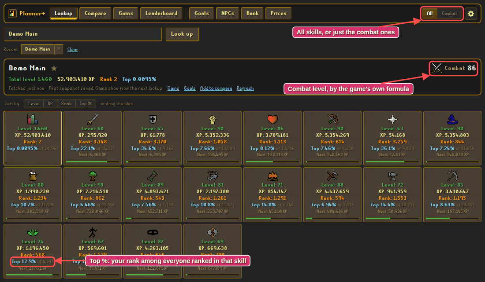
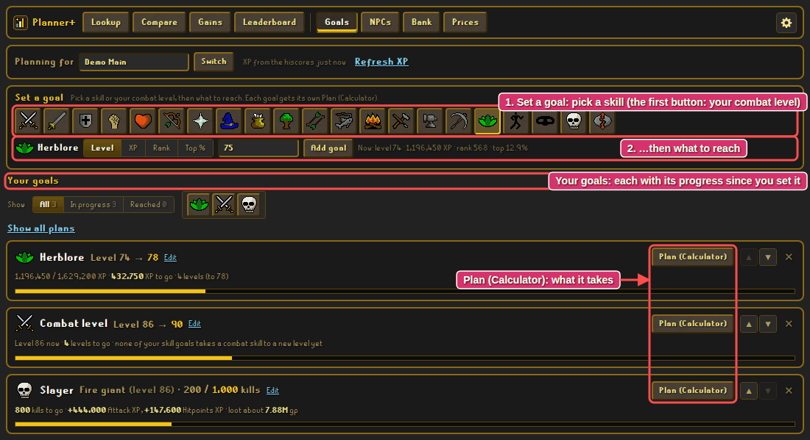
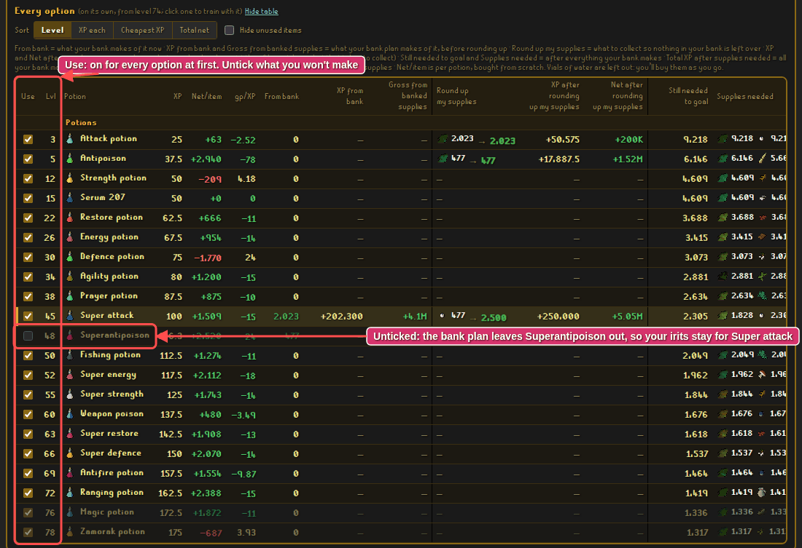
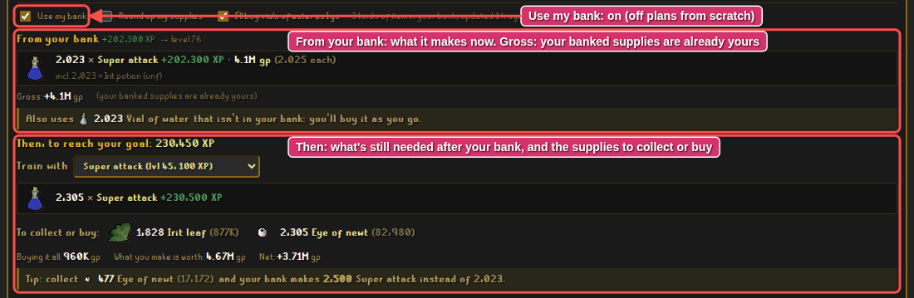
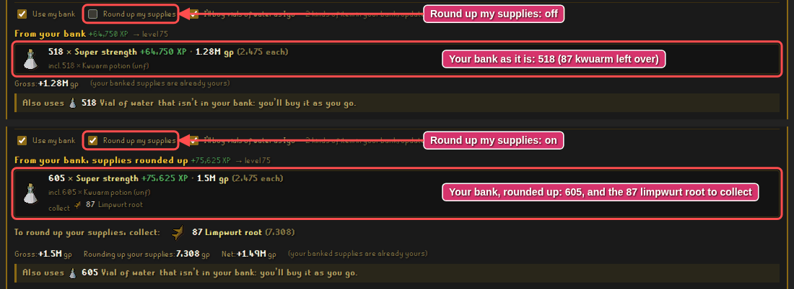
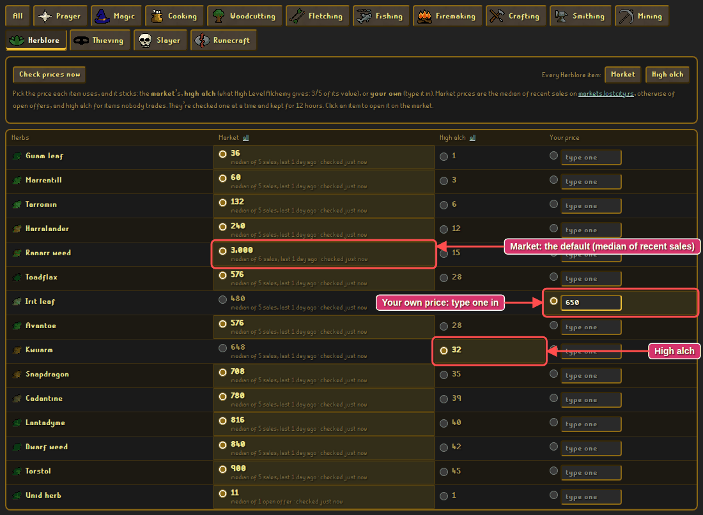
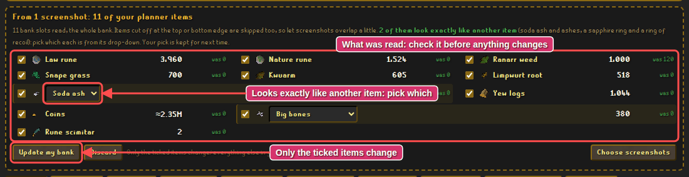
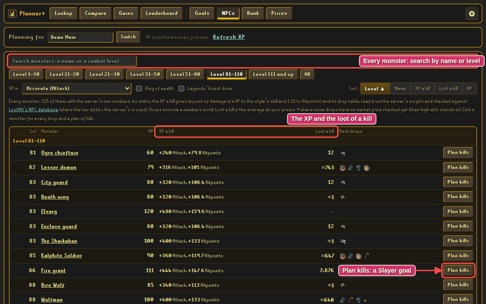
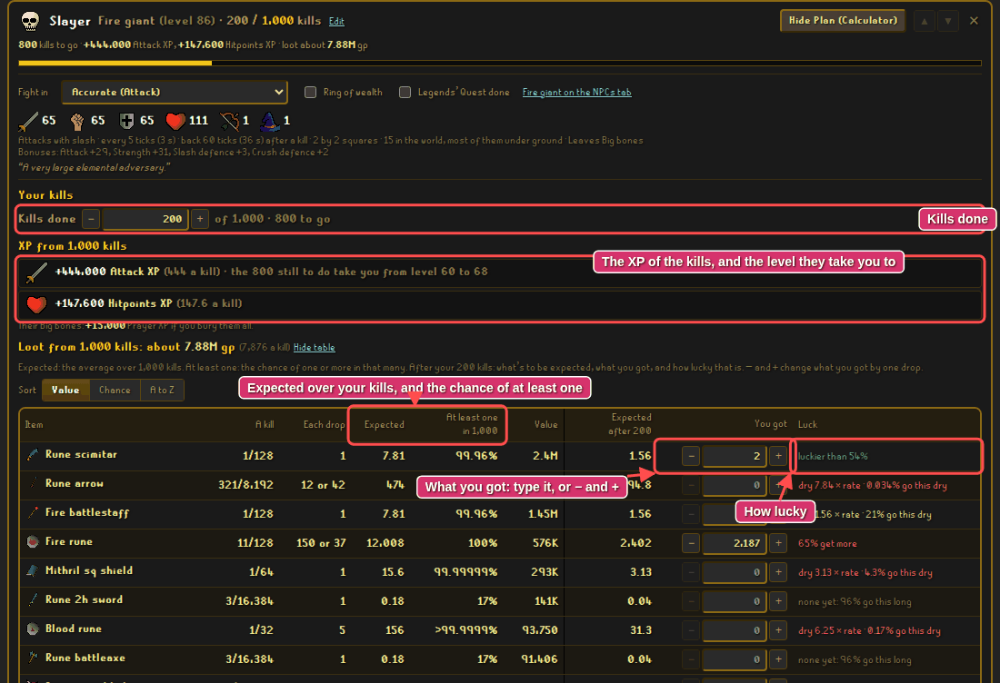
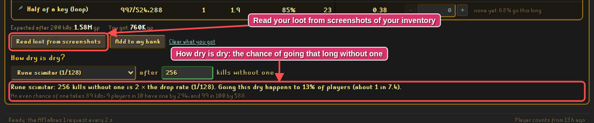

# Planner+

A planner for [Lost City](https://2004.lostcity.rs) (2004scape), made to run as a
[LostKit](https://github.com/LostHQ/LostKit-Electron) tool: goals with a calculator for every skill,
monsters and their loot, your bank, and market prices, with the hiscores alongside.
Formerly Skills+ (and before that Hiscores+).

**Open it:** <https://im-hari-potter.github.io/planner-plus/>

Every number is the game's own, read from Lost City's server files: levels, XP, what each way to
train takes and makes, monsters' stats and drop tables. LostHQ's calculators and NPC database are
what those are checked against; where the two differ, the server wins.

- [What it does](#what-it-does)
- [Getting started](#getting-started)
- [Lookup](#lookup)
- [Goals and Plan (Calculator)](#goals-and-plan-calculator)
- [Important: choose what you actually use](#important-choose-what-you-actually-use)
- [Use my bank](#use-my-bank)
- [Round up my supplies](#round-up-my-supplies)
- [Prices and gp](#prices-and-gp)
- [Your bank, and reading it from screenshots](#your-bank-and-reading-it-from-screenshots)
- [Combat, monsters and loot](#combat-monsters-and-loot)
- [Useful tips](#useful-tips)
- [Skill by skill](#skill-by-skill)
- [Technical notes, development and credits](#technical-notes-development-and-credits)

## What it does

You set a goal, Planner+ works out what it takes. It starts from your XP on the hiscores, uses
what's in your bank first, and prices everything with market prices (or yours). Then it shows
what's still to do, what to collect or buy, and what it all comes to in gp.

| Tab | What it's for |
|---|---|
| **Lookup**, **Compare**, **Gains**, **Leaderboard** | The hiscores: any player's levels, XP, rank and Top %; players side by side; XP gained since last time; any skill's rankings. |
| **Goals** | Your goals, each with its **Plan (Calculator)**: every skill, your combat level, and Slayer (a plan of kills and their loot). |
| **NPCs** | Every monster: its stats, the XP of a kill and every drop with its chance. |
| **Bank** | What you have, typed in or read from screenshots. Plans use it first. |
| **Prices** | The price each item uses: the market's, high alch, or your own. |

## Getting started

1. **Add it to LostKit.** Click **Add tool** and enter `im-hari-potter.github.io/planner-plus`. The
   name and icon fill themselves in. (Added it back when it was Skills+ or Hiscores+? Right-click
   the tool, **Edit…**, and put in the new address. Your goals, bank and prices stay: they're kept
   in LostKit, not on the site.)
2. **Open Goals and enter your username** under *Planning for*. Your XP comes from the hiscores.
   Each account has its own goals and bank, so alts can have theirs.
3. **Put in your bank** (Bank tab): type amounts in, or read them from screenshots.
4. **Look over Prices** for the items you'll use (see [Prices and gp](#prices-and-gp)).
5. **Set a goal and open its Plan (Calculator).**

Everything is kept in your own browser (LostKit's). **Settings** (the cog) makes a backup to
restore or move it.

## Lookup

*Lookup: a player's levels, XP, rank and **Top %**, worked out as their rank among everyone ranked
in that skill.*

- Sort the tiles by level, XP, rank or Top %, or drag them into your own order.
- **Combat** shows the combat skills, your combat level by the game's own formula, what the next
  level takes, and a calculator to try other levels.
- Once you have goals, a tile's bar is your progress toward its goal.
- The names you look up are kept under **Recent**; ✕ takes one off. The last player you looked up
  is there again whenever the tab opens.

**Compare** puts up to 5 players side by side, **Gains** shows what someone gained since last time
(a day, a week, a month), and **Leaderboard** any skill's hiscores with Top % beside every rank.

## Goals and Plan (Calculator)

*Pick a skill (or your combat level, or Slayer), then what to reach. Each goal sits under **Your
goals** with its progress since you set it, and its **Plan (Calculator)**.*

- A goal is a **level, XP, rank or top %**. A rank or top % goal means beating whoever holds it
  now, and is checked again as they train. **Edit** moves the goalpost and keeps the rest.
- **Combat level** is a goal too (the first button). Its plan says what each kind of level takes
  to get there, with the combat calculator under it.
- **Slayer** isn't in this version of the game yet; here it's the home of monster plans. See
  [Combat, monsters and loot](#combat-monsters-and-loot).
- Move goals up and down, and filter them: in progress, reached, or one skill's.

**Plan (Calculator)** opens a goal's plan, in three parts:

1. **From your bank**: what the items in your bank make, best XP first, with steps on the way
   counted (unfinished potions, gems cut for jewellery, bars smelted for smithing).
2. **Then, to reach your goal**: the rest, made the way you pick under **Train with**, with what to
   collect or buy and what it costs and makes.
3. **Every option**: the calculator, a table of every way to train, side by side. Click a row to
   train with it.

How many you need is the XP still to go ÷ the XP each one gives, rounded up. Everything is done in
tenths of XP, the way the game keeps it.

## Important: choose what you actually use

*The **Use** column, first in the table. Every option starts ticked: untick what you won't make.*

The bank plan makes everything it can from your bank. **Every option starts out ticked**, so it
will spend your supplies on anything that uses them, even things you'd never make. **Untick what
you won't make.** Otherwise From your bank, Still needed and the gp totals count XP you won't get.

For example: 2,500 irit, 2,023 eye of newt and 477 unicorn horn dust in the bank. Super attack
gets the irits first, and the 477 left over become Superantipoison. Don't want Superantipoison?
**Untick it**, and those 477 irits stay in your bank for Super attack: of the 2,305 Super attacks
still needed (see below), you collect 1,828 irits instead of 2,305.

- An unticked option also leaves the **Train with** list.
- **Hide unused items** (beside the table's Sort) takes the unticked rows out of every plan's
  table.
- What a ticked row needs is still made on the way: untick Sapphire (cut) and the sapphires for
  your games necklaces are still cut. To leave uncut sapphires alone, untick what's made of them.

## Use my bank

*Use my bank on: your bank first (its value is a gross: the supplies are already yours), then
what's still needed after it, and the supplies to collect or buy.*

Herblore 74 → 78, training with Super attack:

- **Use my bank off**: the plan starts from scratch, as if your bank were empty. **4,328** Super
  attacks to the goal, with every supply bought.
- **Use my bank on** (the default): your bank goes first. It makes **2,023** Super attacks, and
  **2,305** are still needed after them, with the supplies they take (less what's left in your
  bank). What your bank makes is shown as **Gross**: the supplies are already yours, so nothing is
  taken off for them.

With Use my bank off you can plan a mix of your own instead: type how many of each you'll make in
the table's **Plan to make** column, and the rest of the goal is planned after it.

Your bank goes to the best XP first, and where two potions want the same herb, the more useful one
gets it (Super attack before Superantipoison, Prayer potion before Fishing potion). Drag the lines
under From your bank to put your own first; **Back to the usual order** undoes it.

## Round up my supplies

*Off, your bank as it is; on, rounded up so nothing is left over, with what to collect.*

**Round up my supplies** is a second view of your plan: what your bank would make if you collected
just what it's short of.

- 605 kwuarm and 518 limpwurt root make **518** Super strength. 87 kwuarm are left over.
- Round up my supplies: collect **87 limpwurt root**, and the same bank makes **605**.

Your most plentiful ingredient decides how many. It rounds up what your bank already makes, then
anything that's one ingredient short (irit with no eye of newt, bows cut but not strung). Cheap
things never hold it back: vials of water and thread, the runes a spell on the way takes, a ring of
forging. The table shows both views side by side: **Round up my supplies** says what to collect
for each row and what your bank makes of it then.

## Prices and gp

*Each item uses one price, and it sticks: the market's, high alch, or one you type.*

Costs, gross, net and gp per XP are only as good as the prices behind them. **Look over the Prices
tab for the items you'll use, and pick or type the price that's right for you.** Anything without
a price shows **?** until it has one.

- **Market** (the default): the median of recent sales on
  [markets.lostcity.rs](https://markets.lostcity.rs), otherwise of open offers. Nobody trading it?
  Its high alch value.
- **High alch**: what High Level Alchemy gives, 3/5 of its value, the game's own sum.
- **Your price**: type one in, and it's used until you pick another.
- Switch a whole skill or one list at once. **All** has every item once, under the skill it first
  belongs to.

**A price is both what a supply costs you and what a product is worth.** Say you mined your own
coal and set its price to 0: smithing steel bars from it now shows almost pure profit. But that coal
would sell at the market's price, and using it for bars means not selling it. Leave coal at the
market's price and the plan shows that value too, so you can see whether the bars are worth more
than the coal and ore you put in.

- **Gross**: what something is worth, nothing taken off. Your banked supplies are counted this way:
  they're yours already.
- **Net**: worth less what its supplies cost, so it can be negative.
- **gp/XP**: what each XP costs you (negative: you make money doing it).

Market prices are checked one at a time and kept for 12 hours. Click an item anywhere to open it on
the market (inside LostKit it opens in the tool's tab; ◀ comes back).

## Your bank, and reading it from screenshots

*What was read from your screenshots, to check before anything changes. A stack that looks exactly
like another item gets a drop-down.*

- Type what you have: `1500`, `1.5k` and `2m` all work. Each skill has a tab of its items (and
  what they're worth), and **All** has everything you have: in your bank's order, by value, or by
  skill.
- **Read it from screenshots**: open your bank in LostKit and press the screenshot key (scroll and
  take more if it doesn't fit). Drop the pictures from *Pictures › LostKit Screenshots* on the
  Bank tab, paste one, or **Choose screenshots**.
  - It reads the picture the way the game drew it: icon outlines and colours say which item is in
    each slot, and the yellow numbers how many. Overlapping screenshots don't count twice.
  - Some items look exactly like another (soda ash and ashes, big bones and jogre bones, a sapphire
    ring and a ring of recoil): pick which from the drop-down. Your pick is kept for next time.
  - Amounts of 100K and up are rounded on screen (`150K`): an amount you entered that fits is kept.
  - Only the ticked lines change your bank.
- **Slayer** has a tab of everything monsters drop, by kind (runes, weapons, armour, gems, herbs,
  bones…). Items a skill uses too are on that skill's tab as well: it's one bank.

## Combat, monsters and loot

**Attack, Strength, Defence, Hitpoints and Ranged** are trained on monsters: a row is a monster, and
a plan counts kills. A kill is the monster's hitpoints in damage, and every point of damage gives
XP by your style, the server's own sum: 4 XP to the style's skill (Controlled: 1.33 to each of
Attack, Strength and Defence; Longrange: 2 to Ranged and Defence), and 1.33 to Hitpoints whatever
the style. With no monster picked, a plan trains on the one with the most XP a kill among those no
more than half your combat level. Each plan says what its kills give besides (Hitpoints XP, bones
to bury), and what its goal adds to your combat level.

### NPCs: the monster database

*Every monster, with the XP and the loot of a kill. Search by name or combat level, or browse by
level.*

Click a monster for its page: its stats and how it fights, the XP of a kill in every style, and
every drop with its chance a kill (as the drop table has it: 1/128, 3/128…), how many a drop is,
and the kills it takes for an even chance of one, and for 9 in 10. Drops are worked out for a
members world, from the server's own drop scripts. Tick **Ring of wealth** or **Legends' Quest
done**: both change the gem table.

### Slayer goals: a plan of kills

*A Slayer goal: the XP of its kills and the level they take you to, the loot to expect, and, once
you've done some, what you got and how lucky that is.*

A Slayer goal is a monster and a number of kills. Make one from the Slayer button on Goals, with
**Plan kills** on the NPCs tab, or with **Plan the loot** on a monster's line in any combat skill's
plan: "1,992 × Fire giant" makes a Slayer goal of those 1,992 kills, in that goal's style (once made,
the line opens it).

Its plan has:

- **Kills done** (type them, or − and +), and the goal's progress.
- **XP**: what the kills give each skill, and the level the ones still to do take you to.
- **Loot**: every drop with its chance a kill, how many to expect over your kills, the chance of at
  least one, and its value at your prices.
- **What you got**: type it in, or − and + a drop at a time. After your kills, each drop says
  what's to be expected and how lucky you are: "luckier than 54%", "65% get more".
- **Dryness**: a drop you haven't had says how dry you are, and how many players go that dry.
- **Read loot from screenshots**: a screenshot of your inventory for each trip (your bank can be
  open). Only what the monster drops is read; untick anything you brought along, then add it to
  what you got.
- **Add to my bank** puts what you got in your bank (and takes back what you correct).

*How dry is dry: any drop, any number of kills without it.*

A drop of 1/128 and 200 kills without it is 1.56 × the drop rate, and more to the point: **going
that dry happens to 21% of players**, about 1 in 5. An even chance of one takes 89 kills; 9 in 10
players have one by 294.

## Useful tips

- **Untick what you won't make** (see above). It's the one thing that changes a plan the most.
- **Check the prices** of what a plan uses before trusting its gp.
- **Hide table** tucks one plan's table away, and **Hide all tables** every open plan's.
- A number you're typing is left alone until you enter it (Enter, Tab or a click elsewhere), so
  prices arriving meanwhile don't get in the way.
- Some items look exactly alike in this version (soda ash and ashes): screenshots ask which.
- After an update, press Ctrl+R once if something looks off: a browser can keep the last version's
  files for a few minutes.
- The numbers are the game's own, so a few may surprise you: achey logs give no Firemaking XP, any
  axe works at any Woodcutting level, Crumble Undead gives 49 Magic XP, and a point of damage is
  1.33 Hitpoints XP, not a third of 4.

## Skill by skill

What each skill's planner counts, and where the server and LostHQ's calculators differ

- **Herblore**: unfinished potions are made on the way. A potion waits for the more useful one its
  herb makes. **I'll buy vials of water as I go** (on at first) leaves vials out of costs. Every
  "Herb" in your bank is one Unid herb entry until identified.
- **Runecraft** counts in essence, with the runes each makes at your level (×2, ×3…).
- **Woodcutting**, **Mining** and **Fishing** don't use your bank: what to gather and what it's
  worth. A gem rock is its gems' chances; Mining can plan by the bar (a steel bar: 1 iron ore, 2
  coal). Fishing lists the gear and the bait or feathers to buy.
- **Firemaking** burns your bank's logs, best first. **Fletching** has bows, arrows, darts and
  bolts. **Prayer** buries bones from your bank, best first.
- **Crafting**: gems are cut, glass blown, wool spun and hides tanned on the way (the tanner's fee
  counted: Al Kharid or Canifis). Battlestaves are planned from soda ash and sand through molten
  glass, orbs and charging, each stage's XP counted. Key halves count as the crystal chest's
  dragonstone.
- **Smithing**: ore is smelted on the way. Buy bars, smelt them or superheat them; a ring of
  forging and goldsmith gauntlets are choices.
- **Cooking**: burnt food is counted by the server's own chances, a level at a time (cooking
  gauntlets and Lumbridge's range count). Pies, pizzas and cakes are put together on the way.
- **Thieving** counts thefts that work, by the server's roll, and loot at its price. **Agility**
  counts laps and the Agility Arena's tickets.
- **Magic**: your bank's runes go to the best teleport and combat spell they allow by themselves; a
  curse or alchemy waits until you pick it. Jewellery and orbs are made on the way; a staff stands
  in for its runes.
- Where LostHQ's calculators and the server differ, the server's number is used: a sapphire
  necklace is Crafting level 20 (not 22), Stun gives 90 Magic XP (not 80), Falador's crumbling wall
  12.5 Agility XP (not 0.5), and the server's own rows are added (limestone, monkey bones).

## Technical notes, development and credits

How it's built, how to run it, and where the data comes from

Plain HTML, CSS and JavaScript, with no build step for the site.

- `node --test` runs the unit tests. `node mock-server.mjs` serves the site with a fake hiscores
  API and a fake market at <http://localhost:8787/?api=local>, and `node e2e.mjs` runs the browser
  tests against it (needs Playwright).
- The game data is generated: `node build-data.mjs <Content checkout> <LostHQ 2004 checkout>`
  (needs `sharp`) writes `gamedata.js`, `npcdata.js`, `items.png`, `bankread-data.js` and
  `bankicons.png`. Upload them together: the data names its icon sheets with a stamp of the
  picture.
  - Content is [LostCityRS/Content](https://github.com/LostCityRS/Content), branch 274: levels, XP,
    what everything takes and makes, item values, monsters, their stats and their drops.
  - [LostHQ/2004](https://github.com/LostHQ/2004) gives item names and icons, and the rows of its
    calculators (which ways to train there are). Every number in them is checked against the
    server's, and the build stops at any difference it hasn't been told about.
  - Drops: `build-drops.mjs` reads the server's drop scripts (`scripts/drop tables` and each NPC's
    death script) and follows every value a `random()` can take into a table of rows and chances,
    with the shared tables (herbs, gems, the rare drop table) as references. They're checked
    against LostHQ's NPC database; where the two differ (43 NPCs as of rev 274), the server's are
    used. What a monster leaves to bury is the server's too.
- Planner files: `planner.js` (the maths, in tenths of XP), `planner-ui.js` (Goals, Bank and
  Prices), `npc-ui.js` (the NPCs tab and Slayer goals), `loot.js` (drop chances, expected loot,
  luck and dryness), `prices.js` (the market and high alch), `bankread.js` (reading the bank and
  the inventory from screenshots; `bankfake.mjs` paints pretend ones for the tests), `sortable.js`
  (dragging).
- The hiscores API allows one request every 2 seconds, so lookups queue up. It only lets its own
  website read it from a browser; LostKit's tool tabs are the exception, and a copy hosted on
  Netlify (see `_redirects`) works in any browser. A GitHub Action refreshes each skill's player
  count (for Top %) twice a day.

**Credits.** Hiscores from the Lost City hiscores API. Levels, XP, item values, monsters and their
drops, spell icons, and the bank layout and font the screenshot reader uses, from Lost City's server
content and client (MIT). Item names and icons, and the rows of LostHQ's calculators, from
[LostHQ](https://2004.losthq.rs) (GPL-3.0). Prices from
[markets.lostcity.rs](https://markets.lostcity.rs). Skill icons and RuneScape fonts from
[LostKit](https://github.com/LostHQ/LostKit-Electron) (GPL-3.0); the Slayer skull is Planner+'s own.
RuneScape is © Jagex Ltd.

This is a fan project, not affiliated with Jagex, Lost City or LostHQ. Licensed under GPL-3.0.

